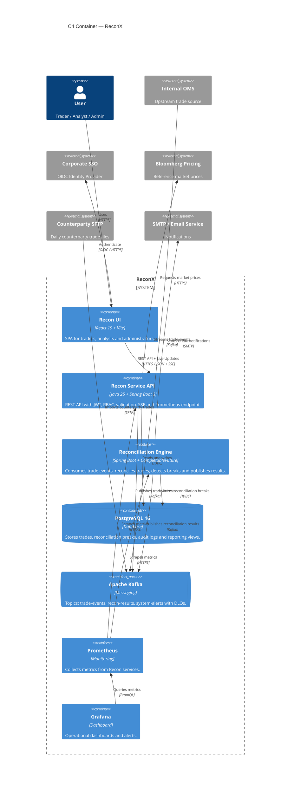

```mermaid
C4Container
title C4 Container — ReconX

Person(user, "User", "Trader / Analyst / Admin")

System_Ext(oms, "Internal OMS", "Upstream trade source")
System_Ext(sso, "Corporate SSO", "OIDC Identity Provider")
System_Ext(bloomberg, "Bloomberg Pricing", "Reference market prices")
System_Ext(sftp, "Counterparty SFTP", "Daily counterparty trade files")
System_Ext(email, "SMTP / Email Service", "Notifications")

System_Boundary(reconxBoundary, "ReconX") {

    Container(reactSpa, "Recon UI", "React 19 + Vite", "SPA for traders, analysts and administrators.")

    Container(api, "Recon Service API", "Java 25 + Spring Boot 3", "REST API with JWT, RBAC, validation, SSE and Prometheus endpoint.")

    Container(reconEngine, "Reconciliation Engine", "Spring Boot + CompletableFuture", "Consumes trade events, reconciles trades, detects breaks and publishes results.")

    ContainerDb(postgres, "PostgreSQL 16", "Database", "Stores trades, reconciliation breaks, audit logs and reporting views.")

    ContainerQueue(kafka, "Apache Kafka", "Messaging", "Topics: trade-events, recon-results, system-alerts with DLQs.")

    Container(prom, "Prometheus", "Monitoring", "Collects metrics from Recon services.")

    Container(graf, "Grafana", "Dashboard", "Operational dashboards and alerts.")

}

Rel(user, reactSpa, "Uses", "HTTPS")

Rel(reactSpa, sso, "Authenticate", "OIDC / HTTPS")

Rel(reactSpa, api, "REST API + Live Updates", "HTTPS / JSON + SSE")

Rel(oms, kafka, "Streams trade events", "Kafka")

Rel(sftp, kafka, "Imports counterparty trades", "SFTP")

Rel(api, postgres, "Reads and writes", "JDBC")

Rel(api, kafka, "Publishes trade events", "Kafka")

Rel(api, bloomberg, "Requests market prices", "HTTPS")

Rel(reconEngine, kafka, "Consumes trade events", "Kafka")

Rel(reconEngine, postgres, "Reads trades", "JDBC")

Rel(reconEngine, postgres, "Writes reconciliation breaks", "JDBC")

Rel(reconEngine, kafka, "Publishes reconciliation results", "Kafka")

Rel(reconEngine, email, "Sends break notifications", "SMTP")

Rel(prom, api, "Scrapes metrics", "HTTPS")

Rel(prom, reconEngine, "Scrapes metrics", "HTTPS")


Rel(graf, prom, "Queries metrics", "PromQL")
```