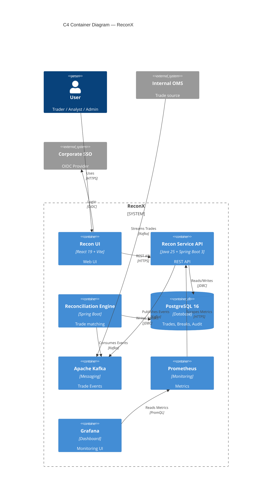

```mermaid
C4Container
title C4 Container Diagram — ReconX

Person(user, "User", "Trader / Analyst / Admin")

System_Ext(oms, "Internal OMS", "Trade source")
System_Ext(sso, "Corporate SSO", "OIDC Provider")

System_Boundary(reconx, "ReconX") {

    Container(ui, "Recon UI", "React 19 + Vite", "Web UI")

    Container(api, "Recon Service API", "Java 25 + Spring Boot 3", "REST API")

    Container(engine, "Reconciliation Engine", "Spring Boot", "Trade matching")

    ContainerDb(db, "PostgreSQL 16", "Database", "Trades, Breaks, Audit")

    Container(kafka, "Apache Kafka", "Messaging", "Trade Events")

    Container(prometheus, "Prometheus", "Monitoring", "Metrics")

    Container(grafana, "Grafana", "Dashboard", "Monitoring UI")
}

Rel(user, ui, "Uses", "HTTPS")

Rel(ui, api, "REST API", "HTTPS")

Rel(ui, sso, "Login", "OIDC")

Rel(api, db, "Reads/Writes", "JDBC")

Rel(api, kafka, "Publishes Events", "Kafka")

Rel(engine, kafka, "Consumes Events", "Kafka")

Rel(engine, db, "Writes Breaks", "JDBC")

Rel(oms, kafka, "Streams Trades", "Kafka")

Rel(prometheus, api, "Scrapes Metrics", "HTTPS")

Rel(grafana, prometheus, "Reads Metrics", "PromQL")
```